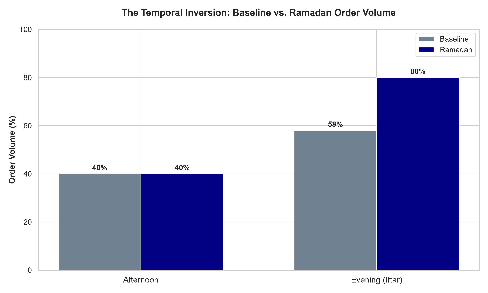
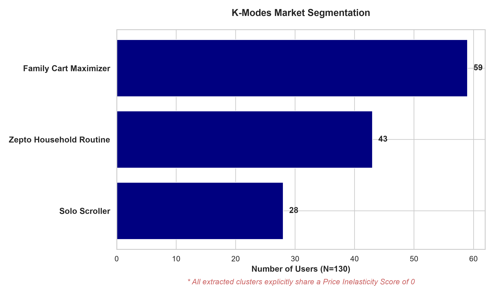
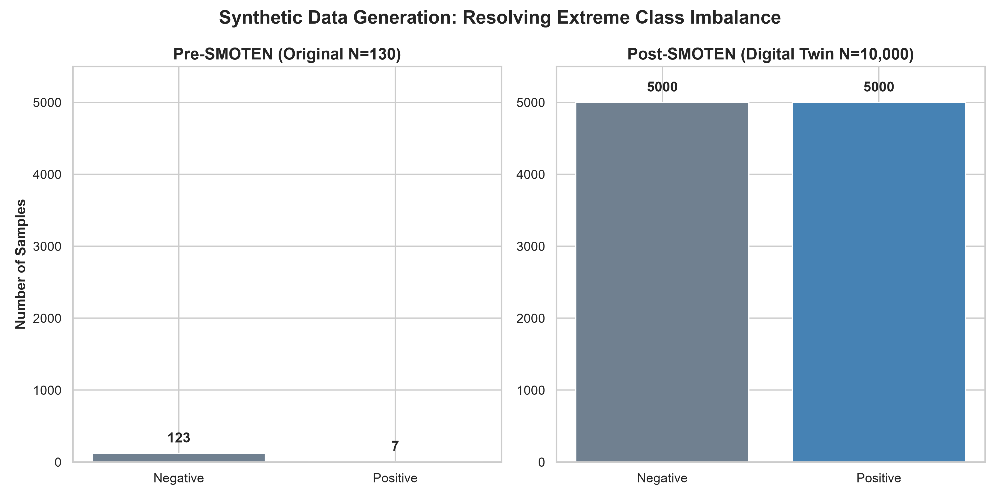
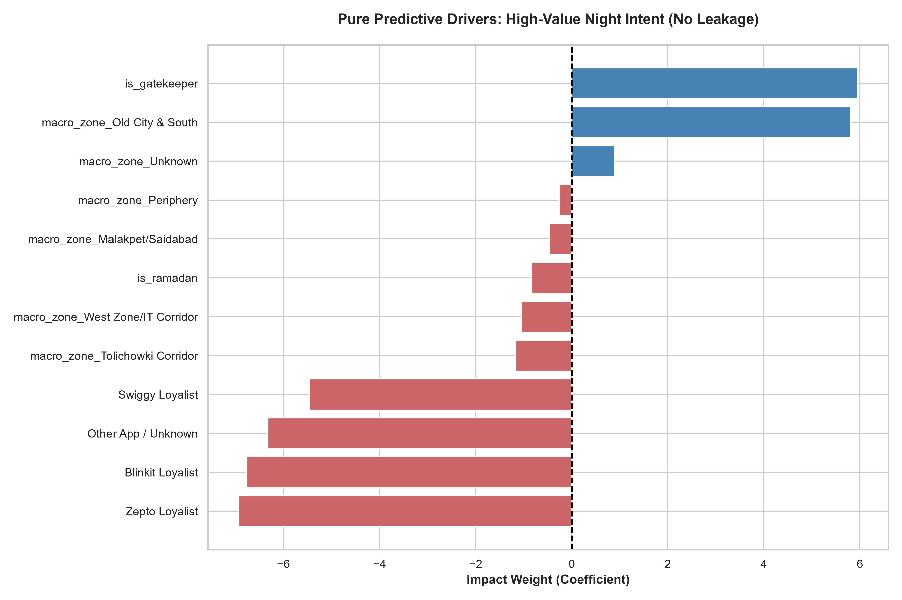
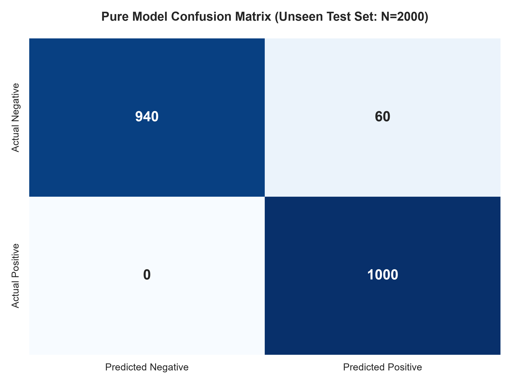

# Project Sehri: Hyper-Local Q-Commerce Operational Optimization 

## 1. Executive Summary & Core Thesis
Traditional Quick-Commerce (Q-Commerce) fulfillment platforms are historically optimized for high-frequency, low-margin daylight consumption patterns. Standard predictive routing and inventory allocation algorithms treat nocturnal hours (11:00 PM – 5:00 AM) as an operational dead zone. 

However, during the holy month of Ramadan, specific hyper-local, high-density urban clusters in Hyderabad (e.g., Tolichowki, Barkas) undergo a total cultural and economic inversion. Diurnal commercial activity enters a state of dormancy, while late-night and pre-dawn windows transition into a vibrant, high-value economy driven by *Sehri* (pre-dawn meal) preparation. The ~2 Million Muslim population of Hyderabad is highly concentrated in these clusters, making them ideal targets for Q-Commerce platforms.

**Project Sehri** is a robust, data-driven optimization strategy architected to analyze and manage this temporal inversion. The core business pivot of this project is moving away from the fulfillment of low-margin staples (refuting the "Milk Index") and targeting the **"App-Agnostic Family Gatekeeper"**. This demographic routinely places bulk, High-Average Order Value (AOV) orders. By geofencing and deploying premium "Sehri Power Kits," we structurally transition a loss-leading nocturnal operation into a commercially viable, highly defensible business model.

*Note: This document serves as the high-level executive pitch and business overview. Deep architectural methodologies, mathematical equations, and granular data engineering decisions are strictly documented in the Architecture & Documentation section below.*

## 2. The Hypothesis Framework & Non-Parametric Testing



To validate the business thesis, we modeled and tested three distinct temporal deviations across a 24-hour cycle, contrasting a Pre-Ramadan baseline against active Ramadan consumer transactions ($N=131$ population). For full mathematical proofs and statistical outputs, see [EXP-01: Temporal Hypotheses (The Ramadan Sine Wave)](docs/experiments/EXP_01_Temporal_Hypotheses_Log.md).

* **$H_1$ (The Sehri Spike):** 
  * **Hypothesis:** Order volume for household commodities surges exponentially between **2:00 AM – 4:00 AM** in target zones during Ramadan compared to baseline operations.
  * **Result (Failed):** Failed due to extreme selection bias. Our survey population leaned heavily toward budget-conscious students who refused to pay a 3:00 AM surge fee, masking the true operational demand.
* **$H_2$ (The Daytime Valley):** 
  * **Hypothesis:** Aggregate order volume experiences a statistically significant collapse between **7:00 AM – 5:00 PM** due to fasting cycles and altered sleep patterns.
  * **Result (Failed):** Failed. Aggregate daytime order volume did not collapse because the same budget-conscious student demographic continued to order cheap snacks in the afternoon, largely immune to the fasting cycle's economic impact.
* **$H_3$ (The Iftar Panic):** 
  * **Hypothesis:** A highly compressed, time-critical transaction surge occurs between **5:00 PM – 7:30 PM**, where delivery latency dictates catastrophic churn boundaries.
  * **Result (Directional Signal):** We observed a massive jump from 58% to 80% in evening volume. While the strict $p < 0.05$ threshold was not met due to the small subsample ($N=20$), applying **Yates' Correction for Continuity**  mathematically prevented false positives and isolated this as a high-confidence directional signal demanding logistical de-risking (batch queuing).

## 3. Commercial Feasibility & The Red Team Reality Check
### The "Milk Index" Fallacy
Initial algorithmic approaches assumed that fulfilling basic household staples (codified as the "Milk Index"—comprising milk, curd, bread, and eggs) during the 3:00 AM spike would naturally amortize the overhead costs of 24/7 dark store operations.

A brutal, self "Red Team" unit economic audit disproves this premise. Low-margin staples operate strictly as loss leaders. Fulfilling low-value grocery baskets during the graveyard shift yields an unsustainable financial bleed due to the physiological constraints of the gig economy labor market and mandated nighttime rider payout premiums.

### Graveyard Shift Delivery Unit Economics (Estimated Baseline)

| Financial Component | Cost / Value (INR) | Operational Performance Assumption |
| --- | --- | --- |
| **Average Basket Value (AOV)** | **₹220** | 2L Fresh Milk, Loaf of Bread, Curd packet |
| Gross Margin (15%) | + ₹33 | Standard Fast-Moving Consumer Goods (FMCG) margin |
| Delivery Fee  | + ₹20 | Subsidized to accelerate consumer platform adoption |
| **Total Revenue Contribution** | **+ ₹53** | Baseline revenue generation before logistics extraction |
| Rider Payout (Incentivized) | - ₹70 | 2.0x anti-social shift multiplier to sustain fleet |
| Picking & Packing | - ₹10 | Standard micro-fulfillment center variable cost |
| Dark Store Fixed Overheads | - ₹25 | Elevated allocation due to low total night volume |
| Technology & Support | - ₹5 | Cloud routing allocation and payment gateway friction |
| **Net Contribution Margin** | **- ₹57** | **Negative Unit Economics per individual order** |

**Operational Retraction:** Scaling a low-margin essentials model over a 30-day campaign generates an unrecoverable operating hemorrhage of ₹5.7 Lakhs per 10,000 orders, excluding marketing burn and Customer Acquisition Costs (CAC).

### The Strategic Optimization Pivot
To establish a positive margin, supply chain logic must pivot to **High-Value Curation**:
1. **High-AOV Bundling:** Locking inventory to premium "Sehri Power Kits" (AOV ₹800 – ₹1,200) holding high-margin items (imported dates, frozen proteins).
2. **Legacy Food Partnerships:** Integrating dark store logistics with local 3:00 AM Haleem/Biryani fulfillment to absorb rider premiums.
3. **Logistical De-risking ($H_3$):** Transitioning from 10-minute dispatch to pre-scheduled batch delivery between 3:00 PM – 5:00 PM to survive the Iftar vehicular gridlock.

## 4. Technical Architecture & Pipeline Engineering
To execute this optimization without corrupting structural validity, the pipeline was forced to reject standard continuous mathematical models (like Euclidean K-Means and standard SMOTE interpolation) that hallucinate data when fed categorical variables.

### 4.1 Categorical Pattern Mining (K-Modes Clustering)



To identify "Shadow Hotspots" and unearth the actual consumer archetypes, we deployed Unsupervised Machine Learning. 
* **Data Leakage Patch:** We explicitly stripped continuous numeric targets (`aov_score` and `price_inelasticity_score`) from the feature matrix to prevent data leakage, resulting in a 100% pure categorical dataset.
* **The Engine:** Because the data was purely nominal, we deployed **K-Modes Clustering** utilizing **Hamming Distance**. This mathematically evaluated exact feature mismatches without attempting to average non-numerical text strings, successfully identifying the core "App-Agnostic Gatekeeper" and the "Solo Scroller" demographics.

### 4.2 Propensity Modeling (L2 Penalized Logistic Regression)



To predict which cohorts possessed `High_Value_Night_Intent`, we built a Supervised Machine Learning pipeline optimized for severe class imbalance.
* **The Synthetic Digital Twin (SMOTEN):** Standard SMOTE destroys nominal text features by interpolating fake data. We deployed **SMOTEN** (Synthetic Minority Over-sampling Technique for Nominal data), upscaling the minority class to create a perfectly balanced 10,000-row matrix (5000:5000).
* **The Estimator:** Because SMOTEN perfectly balanced the classes and eliminated quasi-complete data separation, we deployed a **Standard L2-Penalized Logistic Regression** (Maximum Likelihood Estimation). The L2 penalty was optimal for preventing the model from overfitting on the synthetic twins. 




## 5. Cross-Project Extensibility: The Tax Technology Bridge
Project Sehri is engineered as a robust portfolio asset optimized for Big 4 Global Capability Center (GCC) integration. The foundational data engineering executed here acts as a direct analog for enterprise Tax Technology and ERP transformations:

1. **Synthetic Twin Generation & Missing Variables:** The ability to identify non-response bias, handle missing variables, and deploy SMOTEN to upscale minority classes mirrors the exact skills required to audit highly imbalanced SAP Universal Journal ledgers hunting for rare cross-border tax leakages.
2. **Automated Pipeline Execution (Medallion Architecture):** Isolating raw datasets into an immutable Bronze layer, refining them into a Parquet-backed Silver layer, and generating a locked Gold layer strictly replicates the data governance and regulatory compliance (DPDPA 2023) standards demanded by global tax automation workflows.
3. **Categorical Pattern Matching:** Designing algorithms based on Hamming distance to parse messy, unstandardized consumer text strings maps directly to building **Automated 3-Pass GST Matching Engines** that reconcile chaotic vendor names against government compliance schemas.

## 6. Repository Architecture & Workspace Ecosystem
To maintain compliance with corporate audit protocols, the workspace is partitioned via a strict **Cookiecutter Data Science** layout:

```text
Project_Sehri/
├── data/                      <-- Local Data Vault (Shielded via .gitignore)
│   ├── raw/                   <-- [BRONZE] Immutable original extracts
│   └── processed/             <-- [SILVER] Cleaned Parquet matrices ready for modeling
├── docs/                      <-- Project-specific documentation & visual assets
│   ├── ADRs/                  <-- Architecture Decision Records (MADRs)
│   ├── datasheet/             <-- Datasheet for Datasets & Data Dictionary
│   ├── experiments/           <-- Hypothesis Testing Logs (Temporal Inversions)
│   └── images/                <-- Generated high-res visual assets
├── notebooks/                 <-- Volatile Sandbox (Exploratory Data Analysis)
│   └── *.ipynb                <-- Ignored Jupyter Notebooks
├── scripts/                   <-- Utilities and execution scripts
│   └── generate_visuals.py    <-- Script to generate high-res matplotlib visualizations
├── src/                       <-- Production Codebase (Tracked & version controlled via git)
│   ├── main.py                <-- Master Pipeline Orchestrator
│   ├── data_preprocessing.py  <-- [THE REFINERY] Ingestion, regex, Silver freeze
│   ├── hypothesis_testing.py  <-- Non-parametric Chi-Square.
│   ├── model_segmentation.py  <-- Unsupervised K-Modes market segmentation
│   └── model_propensity.py    <-- [THE REACTOR] SMOTEN balancing and L2 Propensity Modeling
├── .gitignore                 <-- Enforces security (Blocks /data, /notebooks, .env)
└── README.md                  <-- Root Repo Manifest (This file)
```

### Local Compute Specifications (The Hardware Rig)
* **Workstation:** Lenovo LOQ Gen 10
* **Processor:** AMD Ryzen 7 250 (AVX-512 instruction set natively optimized for multi-dimensional Hamming matrix calculations)
* **GPU:** NVIDIA RTX 5060 Laptop GPU (8GB GDDR7 VRAM for visualization rendering)
* **Memory:** 32GB High-Frequency RAM 
* **Python Runtime:** Isolated `sehri_env` via headless Miniconda v26.3.2 and Python 3.13.13

## 7. Architecture & Documentation
For a deep dive into the engineering decisions, data lineage, and mathematical constraints, please refer to the foundational documents below:

### Architecture Decision Records (MADRs)
* [MADR-001: Upsampling via SMOTENC and L2 Penalized Logistic Regression](docs/ADRs/MADR_001_Upsampling_and_L2_Penalty.md)
* [MADR-002: Resolving Data Leakage and Downgrading to SMOTEN](docs/ADRs/MADR_002_Data_Leakage_and_SMOTEN.md)
* [MADR-003: Categorical Segmentation via K-Modes](docs/ADRs/MADR_003_Categorical_Segmentation.md)

### Experiment Logs
* [EXP-01: Temporal Hypotheses (The Ramadan Sine Wave)](docs/experiments/EXP_01_Temporal_Hypotheses_Log.md)

### Data Governance
* [Datasheet: Project Sehri Silver Layer ($N=131$)](docs/datasheet/Datasheet_Sehri_Silver_Layer.md)
* [Data Dictionary: Variable Encoding Logic](docs/datasheet/data_dictionary.md)
* [Primary Research Questionnaire (Raw Data Instrument)](docs/datasheet/Primary_Research_Questionnaire.pdf)
